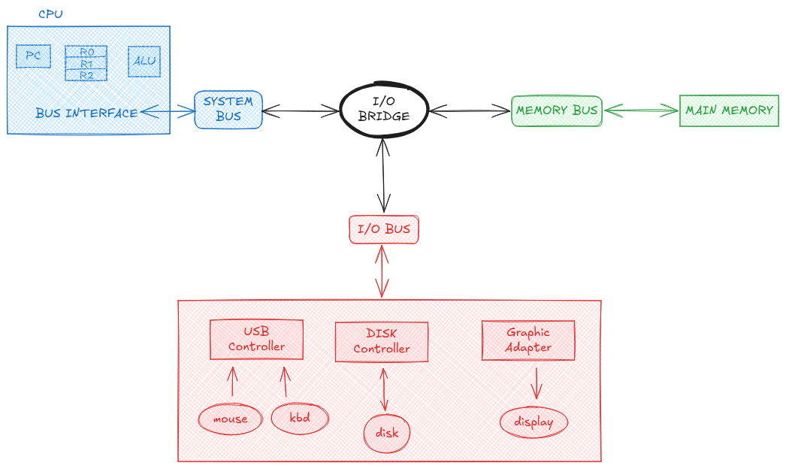

# Inside the Machine: How Buses Connect the System


In the Pentium architecture (used here as an example), communication between major components of the computer system is handled through **three main buses**:

- **System Bus**
- **Memory Bus**
- **I/O Bus**

Each bus transports words of fixed length (typically **8 bytes**) and connects to a central component known as the **I/O bridge**, which coordinates communication among the CPU, main memory, and I/O devices.

---

## System Bus

The **System Bus** connects directly to the CPU through a **bus interface unit** located inside the processor. This interface communicates with the **register file**, which stores data and instructions currently being processed.

- The **program counter (PC)** selects instructions from main memory.
- Retrieved instructions are placed into registers.
- These instructions direct the **ALU (Arithmetic Logic Unit)** on which operations to perform using data stored in the registers.

In short, the system bus enables instruction execution by linking the CPU to the rest of the system.

---

## Memory Bus

The **Memory Bus** connects the **main memory (RAM)** to the I/O bridge and CPU.

- It is responsible for transferring instructions and data between RAM and the processor.
- Both instruction fetches and data loads/stores occur over this bus.

This bus plays a critical role in program execution performance.

---

## I/O Bus

The **I/O Bus** connects external and internal **I/O devices** to the system.

- Each device connects via a **controller** (built-in) or an **adapter** (plug-in).
- Examples include disks, keyboards, displays, and network cards.
- The I/O bridge manages communication between the I/O bus and the system and memory buses.

This structure allows the CPU to interact with a wide variety of devices in a uniform way.

---

## Overall Data Flow (Simplified)

```
CPU (Register File)
        ↓
   System Bus
        ↓
   I/O Bridge
     ↙      ↘
Memory Bus   I/O Bus
   ↓           ↓
 Main Memory  I/O Devices
```

---

This bus-based organization abstracts hardware complexity and allows efficient communication between the CPU, memory, and I/O devices.
