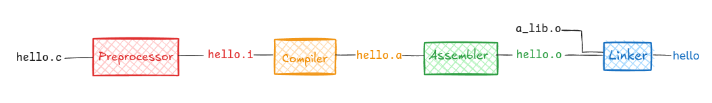

# From C Source to Executable — A Practical Mental Model

This document summarizes the full compilation pipeline using the diagram below as a guide.



---

## 1. Source File (`hello.c`)

This is the original C source code written by the programmer.

```c
int main() {
    return 42;
}
```

At this stage, the file is plain text. The operating system and CPU cannot execute it.

---

## 2. Preprocessor → `hello.i`

**Tool:** C preprocessor (`cpp`, invoked automatically by `gcc`)

**What it does:**
- Textual substitution only
- Expands `#include`
- Expands `#define` macros
- Handles conditional compilation (`#ifdef`, `#if`, etc.)
- Removes comments

**Important:**  
The preprocessor does *not* understand C syntax or types. It only rewrites text.

**Output:**  
A new C file (`.i`) with all preprocessing completed.

---

## 3. Compiler → `hello.s` (assembly)

**Tool:** C compiler proper

**What it does:**
- Parses C syntax
- Performs semantic analysis and optimization
- Translates C code into **assembly language** for the target CPU

At this point:
- C constructs are gone
- The program is now architecture-specific

---

## 4. Assembler → `hello.o` (object file)

**Tool:** Assembler (`as`)

**What it does:**
- Converts assembly instructions into machine code
- Produces an **object file**

**What a `.o` file contains:**
- Machine code for functions defined in the source file
- Symbol table (e.g., `main`)
- Sections (`.text`, `.data`, `.bss`)
- Relocation information

**What it does NOT contain:**
- No program entry point (`_start`)
- No runtime initialization
- No OS-executable headers

**Key point:**  
A `.o` file contains valid machine code but is **not runnable by the OS**.

---

## 5. Linker → `hello` (executable)

**Tool:** Linker (`ld`, usually invoked by `gcc`)

**Inputs:**
- Your object file (`hello.o`)
- Other object files (e.g., `a_lib.o`)
- Startup code (CRT)
- Libraries (e.g., libc)

**What the linker does:**
- Resolves symbol references
- Combines multiple `.o` files
- Adds startup and shutdown code
- Produces a fully-formed executable (ELF on Linux)

---

## 6. CRT (C Runtime) — The Missing Piece

The **C Runtime (CRT)** is native machine code that runs *before* and *after* `main()`.

### CRT responsibilities:
- Defines the real entry point: `_start`
- Sets up stack, heap, and runtime state
- Initializes global and static variables
- Calls `main(argc, argv)`
- Handles program termination and cleanup

### Execution flow:

```
OS loader
  ↓
_start        (CRT)
  ↓
__libc_start_main
  ↓
main()
  ↓
exit()
  ↓
return to OS
```

**CRT is not a virtual machine.**  
It is minimal native startup glue — not like the JVM.

---

## 7. Why `.o` Files Are Not Runnable

Even without external dependencies:

- The OS cannot jump directly to `main`
- No executable headers describe memory layout
- No startup code prepares the runtime environment

The linker + CRT turn raw machine code into a real program.

---

## 8. Final Mental Model

| Stage | Output | Runnable |
|-----|------|---------|
| Source | `.c` | ❌ |
| Preprocessor | `.i` | ❌ |
| Compiler | `.s` | ❌ |
| Assembler | `.o` | ❌ |
| Linker + CRT | executable | ✅ |

---

## One-Sentence Summary

> A `.o` file is valid machine code, but an executable is machine code **plus** runtime startup, metadata, and a defined entry point that the OS knows how to run.